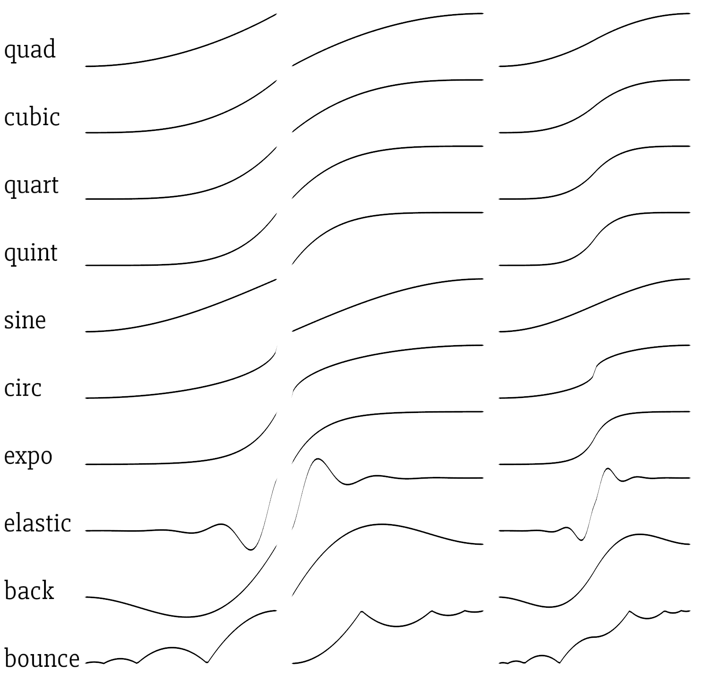

# ezing

## Simple [easing functions](http://easings.net/) for Rust

[](https://travis-ci.org/michaelfairley/ezing)
[](https://docs.rs/ezing)
[](https://crates.io/crates/ezing)


[`quad`, `cubic`, `quart`, `quint`, `sine`, `circ`, `expo`, `elastic`, `back`, `bounce`] x [`in`, `out`, `inout`]

All functions have the signature `fn<F: Float>(F) -> F` (letting you use `f32`, `f64`, or any other type that implements [`num_traits::Float`](https://docs.rs/num-traits/0.2.0/num_traits/float/trait.Float.html)) and expect input ranging from `0.0` to `1.0`. Output is generally in the `0.0` to `1.0` range (except for `elastic` and `back`, which return values slightly outside). `0.0` always maps to `0.0`, and `1.0` always maps to `1.0`.

Use 'em to lerp or something:
```rust
let current_pos = lerp(ezing::cubic_inout(t), start, end);
```


